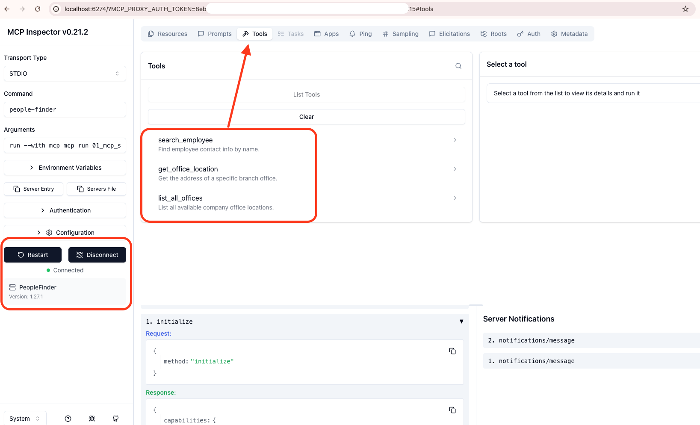

# How to use existing MCP Server

```sh
cd /Users/tripathimachine/Desktop/GitHub_Repo

# Virtual Env
python3 -m venv .ai_venv

source .ai_venv/bin/activate

python --version # Python 3.13.2


# Install MCP Server
pip install mcp-people-finder

# Check Version
pip show mcp-people-finder | grep Version

# Run MCP Inspector
npx @modelcontextprotocol/inspector people-finder
```


